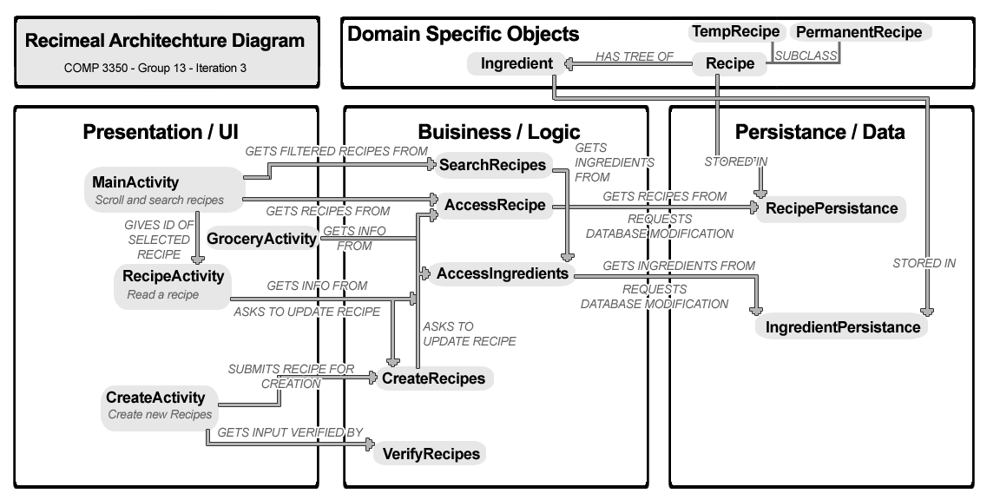

### COMP3350 - Group 13 - Iteration 2 Architecture
# Recimeal Architecture
The application was based upon the sample project provided [here](https://code.cs.umanitoba.ca/comp3350-winter2023/sample) (which is the sample project present in the Iteration 1 description).  It also takes notes from the sample project for writing tests.
### Packages
The packages containing the code for Recimeal are broken into the following sections:
- Application
- Business (comp3350.recimeal.business)
- Objects (comp3350.recimeal.objects)
- Persistance (comp3350.recimeal.persistance)
- Presentation (comp3350.recimeal.presentation)
- Tests (comp3350.recimeal.tests)
### Application Layer
The application layer contains classes needed to start running the app, including **main** and **Services**, which referances to retrieve persistant data.
### Business Layer (Logic Layer)
The **AccessRecipes** class handles interaction with the Recipes like getting recipes, deleting them, adding them, etc. by making calls to the database.
The **AccessIngredients** class is similar to AccessRecipes but for Ingredients.
The **CreateRecipes** class formats and sends to the Data Layer to add a recipe to the Database.
The **VerifyRecipes** class checks if input for creating a recipe is valid.
The **SearchObjects** has functions to do with searching and filtering recipes.
### Objects (Domain Specific Objects)
**Recipe** abstract class holds information about a recipe, including name, instruction and map of ingredients.  It has a methods to get and set its attributes.  It has two subclasses- **TempRecipe** and **PermanentRecipe**.  The only difference is that Permanent recipe has an id corresponding to a database entry, and TempRecipe always returns -1 when queried for an id.
**Ingredient** is a class with name and unit of measurement for an ingredient on the recipe.
### Persistance (Data Layer)
**RecipePersistance** is an interface that allows insertion, deletion and updating for a database.  Its primary implementation is an hsql database represented in RecipeDBPersistence.
**IngredientPersistance** is similar, but handles ingredients in a database.
### Presentation (View/UI Layer)
Contains classes for the visual GUI of the activities.
**MainActivity** is the main screen where the user can scroll through recipes in the database, and search for recipes.
**CreateActivity** is the activity for filling out a form to create a new recipe.
**RecipeActivity** is where a selected recipe is displayed, with all its details.
**GroceryActivity** is a grocery list for viewing and tracking ingredients needed for a recipe.

### Website
Our website is available [here](https://cs-sahil.github.io/ "https://cs-sahil.github.io/") and contains information about the project and its developers.

### Diagram

